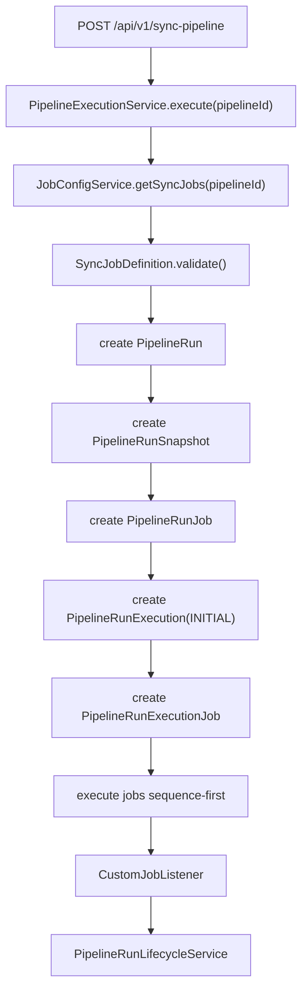
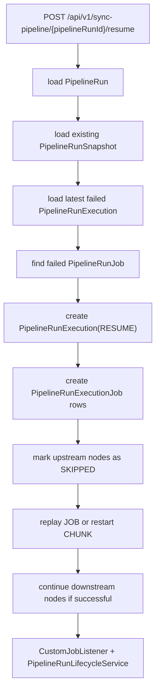
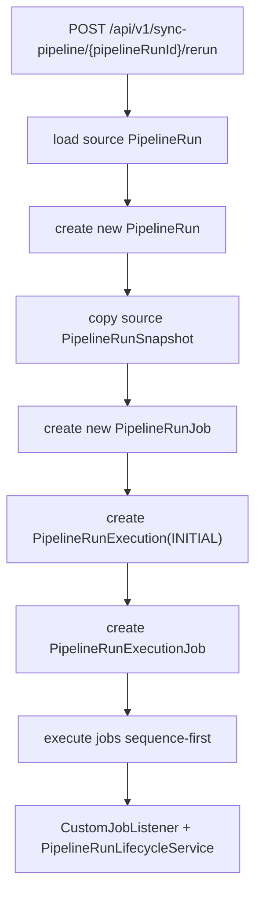

# Core Flow

## 1. Fresh Execute Flow

Fresh execute is the only path that reads the latest persisted pipeline config.

## 2. Resume Flow

Resume behavior:

- `JOB`
  - Replay the failed job as a fresh Spring Batch job instance
- `CHUNK`
  - Restart the failed Spring Batch job instance with stable identifying parameters

## 3. Rerun Flow

Rerun is a brand new logical run.
It replays the source run snapshot and does not use the latest pipeline config.

## 4. Summary and Detail Flow

### Summary

`GET /api/v1/sync-pipeline?ids=...`

- Loads `PipelineRun`
- Uses latest projected status and timestamps
- Returns lightweight run summary objects

### Detail

`GET /api/v1/sync-pipeline/{pipelineRunId}`

- Loads `PipelineRun`
- Resolves `latest_execution_id`
- Loads latest `PipelineRunExecutionJob` rows
- Uses `JobExplorer` to enrich the latest `last_job_execution_id`
- Returns latest run-job detail with step executions

Current detail is latest-attempt oriented, not a full attempt history payload.

## 5. Delete Flow

`DELETE /api/v1/sync-pipeline/{pipelineRunId}`

Current delete behavior:

1. Load all `PipelineRunExecution` rows for the run
2. Load all `PipelineRunExecutionJob` rows across the run lineage
3. Delete related Spring Batch metadata for distinct `last_job_execution_id`
4. Delete execution-job rows
5. Delete execution rows
6. Delete run-job rows
7. Delete run snapshot
8. Delete run

Delete is lineage-aware for the whole run, not only the latest projection.

## 6. Lifecycle Ownership

Runtime status writes are listener-driven:

- `CustomJobListener.beforeJob`
  - marks job started
- `CustomJobListener.afterJob`
  - marks job finished
- `PipelineRunLifecycleService`
  - updates attempt rows first
  - then syncs the latest projection back to `PipelineRun` and `PipelineRunJob`

This keeps sync and async trigger paths on the same lifecycle path.

## 7. Current Gap: Manual Stop

Manual stop is not implemented yet.

What exists already:

- `STOPPING` and `STOPPED` statuses in the runtime model
- listener-driven lifecycle updates
- sequence-first orchestration

What is still missing:

- public stop API
- stop request propagation into the running Spring Batch job
- between-jobs stop guard in pipeline orchestration
- downstream `NOT_RUN` projection after a successful stop
