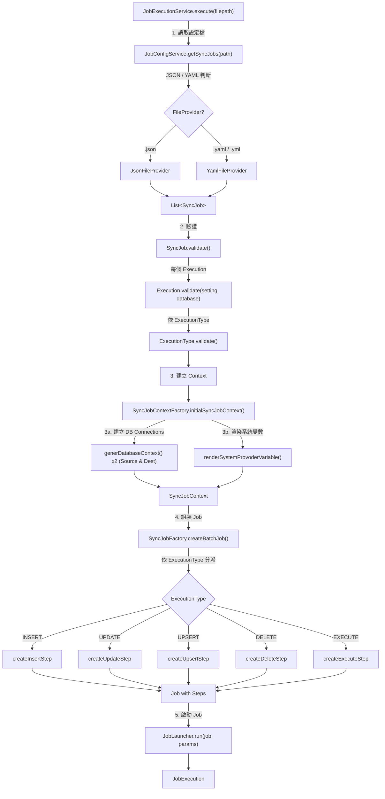
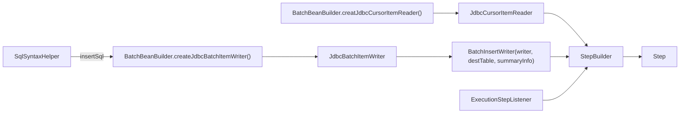
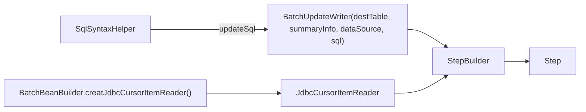
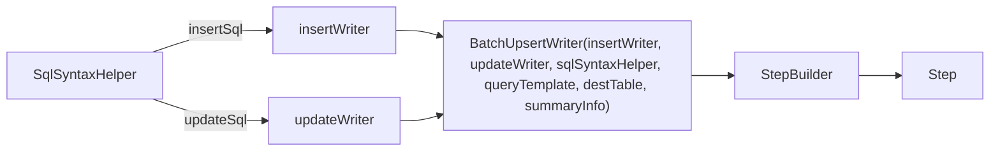
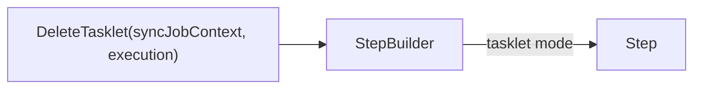
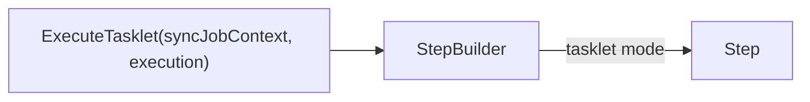

# Core Flow — Job Execution Pipeline

## 主要流程



## 各 Step 類型組裝細節

### INSERT Step



**Processor 邏輯（INSERT/UPDATE/UPSERT 共用）**:
1. 複製 item 為新 Map（避免修改原始資料）
2. 如果有 `watermarkColumn`，將當前值存入 `execution.executionContext()`
3. 遍歷 `sqlSyntaxHelper.columns`，對存在的欄位設為 null（⚠️ 這是目前程式碼的行為，可能是 bug 或特殊設計）

### UPDATE Step



**`BatchUpdateWriter` 特殊行為**:
- 繼承 `JdbcBatchItemWriter`
- `write()` 呼叫 `super.write(chunk)`
- override `processUpdateCounts(int[])` 追蹤更新筆數

### UPSERT Step



**`BatchUpsertWriter` 核心邏輯**:
```
1. queryIdentifierList(chunk)
   → buildExistsQuery(chunkSize)
   → queryTemplate.query(sql, rowMapper, params)
   → List<String> identifiers

2. if (identifiers.size == chunk.size)
   → updateChunk(chunk)       // 全部更新
   
3. if (identifiers.size == 0)
   → insertChunk(chunk)       // 全部新增
   
4. else (mixed)
   → 比對 generateCompositePkIdentifier()
   → 分流到 updateChunk + insertChunk
```

### DELETE Step



**Delete 流程**:
1. 建立 `SqlSyntaxHelper`（取得 `deleteSql`）
2. COUNT 待刪除筆數
3. 與 `deleteThreshold` 比較（threshold = -1 表示不限制）
4. 超過 threshold → 拋出 `CustomJobExecutionException`
5. streaming 方式分 batch 執行 `batchUpdate(deleteSql, batch)`

### EXECUTE Step



**Execute 流程**:
1. 取得 SQL 和參數
2. 在 `TransactionTemplate` 內執行 `namedParameterJdbcTemplate.execute(sql, params, PreparedStatement::execute)`

## Listener 行為

### CustomJobListener (Job 級別)

| Event | openJobTransaction=true | openJobTransaction=false |
|---|---|---|
| `beforeJob` | 開啟交易 (`getTransaction()`) | 無動作 |
| `afterJob` (COMPLETED) | 確保交易成功後，`persistStepExecutionRecords()` 寫入所有 Watermark -> `commit()` -> `close()` | `persistStepExecutionRecords()` -> `close()` |
| `afterJob` (FAILED) | `rollback()` -> `close()` (丟棄所有 Watermark 變更) | `close()` |

### ExecutionStepListener (Step 級別)

| Event | Condition | Action |
|---|---|---|
| `beforeStep` | 無 | log step name |
| `afterStep` | COMPLETED + watermarkColumn 有值 + value 非 null | 暫存進 StepExecution.getExecutionContext() |
| `afterStep` | readCount != 0 | `summaryInfo.total.setPlain(readCount)` |
