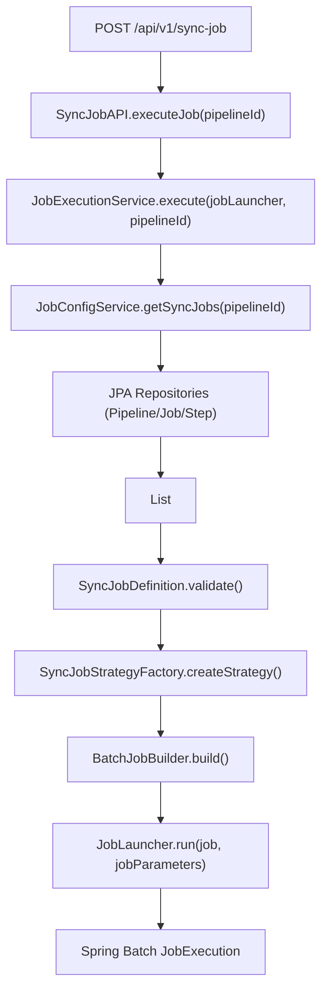

# Core Flow (DB-Driven)

## High-level execution path

## Pipeline management flow

`/api/v1/sync-config` manages the **Pipeline Lifecycle** in the database:

- **GET /sync-config**: Lists all persisted pipelines (id, path, filename).
- **POST /sync-config**: Uploads a file, validates it, and saves it as a new Pipeline in the DB.
- **PUT / PATCH /sync-config/{id}**: Updates an existing Pipeline and its child records in the DB.
- **DELETE /sync-config/{id}**: Removes a Pipeline and all associated Jobs/Steps.

## Job assembly

1. **Reconstruction**: `JobConfigService` performs a recursive join/query across normalization tables to build `SyncJobDefinition` objects.
2. **Context Creation**: `SyncJobContextFactory` builds runtime JDBC data sources.
3. **Batch Mapping**: `SyncJobStrategyFactory` selects the `ExecutionStep` strategy.
4. **Execution**: `JobExecutionService` attaches the `pipeline.id` and `run.id` to `JobParameters` and launches via Spring Batch.

## Restartability Hook
By storing `pipeline.id` in `JobParameters`, the system ensures that a restarted job instance can re-link to the exact configuration stored in the database.
