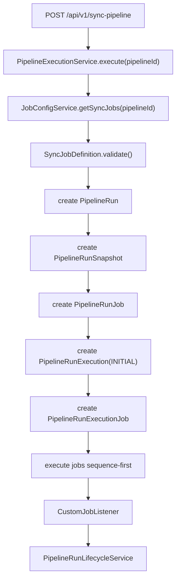
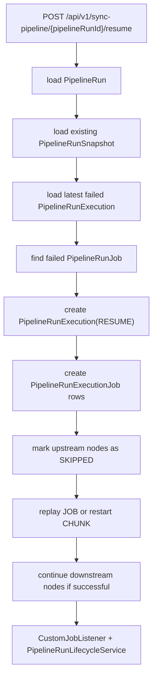
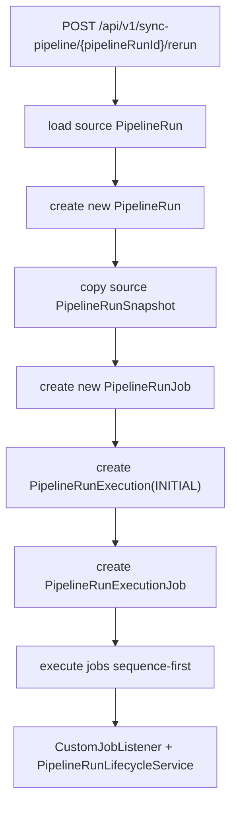
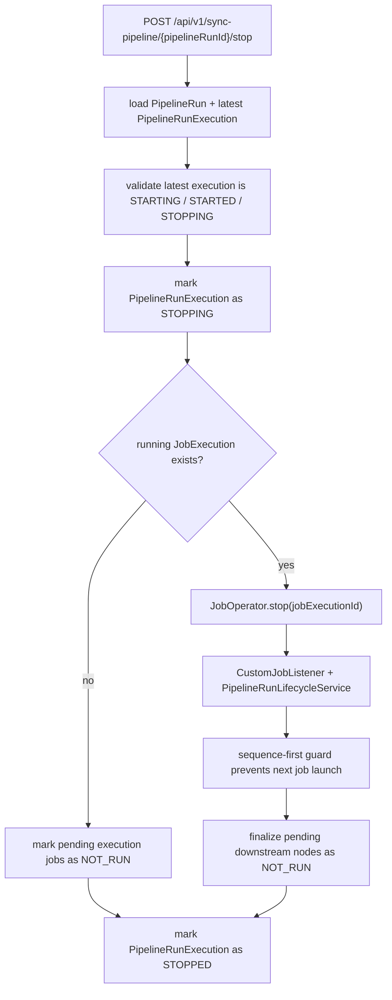

# Core Flow

## 1. Fresh Execute Flow

Fresh execute is the only path that reads the latest persisted pipeline config.

## 2. Resume Flow

Resume behavior:

- `JOB`
  - Replay the failed job as a fresh Spring Batch job instance
- `CHUNK`
  - Restart the failed Spring Batch job instance with stable identifying parameters

## 3. Rerun Flow

Rerun is a brand new logical run.
It replays the source run snapshot and does not use the latest pipeline config.

## 4. Stop Flow

Stop is cooperative, not force-kill.
If stop lands between jobs, the execution can move directly from `STOPPING` to `STOPPED` with downstream nodes marked as `NOT_RUN`.

## 5. Summary and Detail Flow

### Summary

`GET /api/v1/sync-pipeline?ids=...`

- Loads `PipelineRun`
- Uses latest projected status and timestamps
- Returns lightweight run summary objects

### Detail

`GET /api/v1/sync-pipeline/{pipelineRunId}`

- Loads `PipelineRun`
- Uses `PipelineRunQueryService` to assemble the read model
- Loads all `PipelineRunExecution` rows ordered by `executionNo`
- Loads execution-job rows for each attempt in stable `jobSequenceOrder`
- Uses `JobExplorer` to enrich each attempt job from `last_job_execution_id`
- Returns:
  - top-level latest run-job detail in `jobs`
  - ordered attempt history in `attempts`

## 6. Delete Flow

`DELETE /api/v1/sync-pipeline/{pipelineRunId}`

Current delete behavior:

1. Load the latest `PipelineRunExecution`
2. Reject delete unless the latest execution is terminal
3. Load all `PipelineRunExecution` rows for the run
4. Load all `PipelineRunExecutionJob` rows across the run lineage
5. Delete related Spring Batch metadata for distinct `last_job_execution_id`
6. Delete execution-job rows
7. Delete execution rows
8. Delete run-job rows
9. Delete run snapshot
10. Delete run

Delete is lineage-aware for the whole run, not only the latest projection.
Delete returns `400` for `STARTING`, `STARTED`, or `STOPPING` runs.

## 7. Lifecycle Ownership

Runtime status writes are listener-driven:

- `CustomJobListener.beforeJob`
  - marks job started
  - respects already-requested stop before opening normal in-flight work
- `CustomJobListener.afterJob`
  - marks job finished
- `PipelineRunLifecycleService`
  - updates attempt rows first
  - then syncs the latest projection back to `PipelineRun` and `PipelineRunJob`
- `PipelineRunQueryService`
  - assembles summary and detail read models without growing the control service
- `observability`
  - listens to lifecycle-derived observation events and publishes meters

This keeps sync and async trigger paths on the same lifecycle path.

## 8. Operational Observability

- `GET /actuator/health`
  - app health and readiness surface
- `GET /actuator/metrics`
  - Micrometer metric discovery and point-in-time values
- `GET /actuator/prometheus`
  - Prometheus scrape surface

Current metric families include:

- run trigger counters
- terminal execution counters
- terminal job counters
- active run and execution gauges
- execution and job duration timers

## 9. Remaining Gaps

- Dashboards and alert routing are still external follow-up work.
- Tracing and custom runtime health indicators are not implemented yet.
