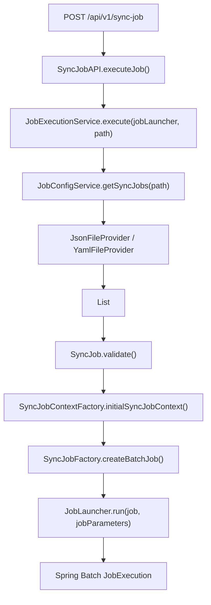

# Core Flow

## High-level execution path

## Config management flow

`/api/v1/sync-config` exposes the file-based config lifecycle used by both manual testing and K6:

- `GET /api/v1/sync-config`
- `GET /api/v1/sync-config?path=...`
- `POST /api/v1/sync-config`
- `PUT /api/v1/sync-config`
- `PATCH /api/v1/sync-config`
- `DELETE /api/v1/sync-config?path=...`

`JobConfigService` validates uploaded files by writing them to a temporary file, loading them through the matching file provider, and calling `SyncJob.validate()` before the real file is persisted.

## Job assembly

For every `SyncJob`:

1. `SyncJobContextFactory` creates source and destination database contexts.
2. System-provided parameters are rendered into each execution context.
3. `SyncJobFactory` maps each execution to a Spring Batch step:
   - `INSERT`
   - `UPDATE`
   - `UPSERT`
   - `DELETE`
   - `EXECUTE`
4. A `CustomJobListener` is attached to the job.
5. `JobExecutionService` launches the job with a fresh `run.id`.

## Step behavior

### INSERT, UPDATE, and UPSERT

These step types all use chunk-oriented processing with a reader, processor, and writer.

The processor currently does three important things:

1. Copies the row into a mutable `Map<String, Object>`.
2. Captures the current watermark value into `execution.executionContext()` when `watermarkColumn` is configured.
3. Backfills only missing destination columns with `null`.

That third point is important: the current implementation no longer overwrites columns that are already present in the source row.

### DELETE

`DeleteTasklet` uses the rendered SQL plus `deleteThreshold` to guard against accidental mass deletion.

### EXECUTE

`ExecuteTasklet` runs the configured SQL against the destination database inside a Spring transaction.

## Watermark persistence

`ExecutionStepListener` stores watermark candidates in the step execution context after a step completes.
`CustomJobListener` persists those records only after the job finishes successfully.

This means:

- successful jobs can advance watermarks
- failed jobs do not persist watermarks
- watermark storage is coupled to the final job outcome, not to individual read operations

## Important current limitation

`atomicLevel` is required by config validation, but the runtime does not yet switch behavior based on it.
`SyncJobFactory` always creates `CustomJobListener` with `openJobTransaction = true`, so the effective execution model is still job-scoped transaction orchestration for every job.
