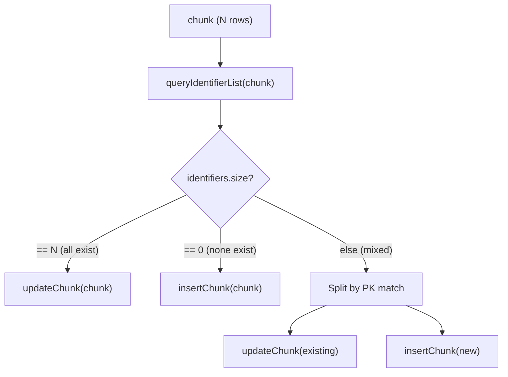

# Design Patterns

## 1. Watermark 機制

### 概念

Watermark 是增量同步的核心，記錄「上次同步到哪裡」，下次同步從該點繼續。

### 涉及元件

| Component | Role |
|---|---|
| `model.SystemProvideVariable` | 定義 4 種系統提供變數 |
| `infrastructure.service.ExecutionRecordService` | 查詢與存取歷史 watermark 值 |
| `core.service.JobExecutionService` | 協調 Job 執行與 Context 初始化 |
| `batch.listener.ExecutionStepListener` | Step 完成後，將新的 watermark 值暫存入 `ExecutionContext` |
| `batch.listener.CustomJobListener` | Job COMPLETED 後，統一將收集的 watermark 寫入 App DB |
| `model.ExecutionStep.executionContext` | 暫存執行期間的 watermark 值 |

### 4 種系統變數

| Variable | 對應 Record 欄位 | 用途 |
|---|---|---|
| `_LAST_WATERMARK` | `last_value` | 上次同步的最後一筆資料值 |
| `_LAST_START` | `last_start_time` | 上次同步 Step 的開始時間 |
| `_LAST_END` | `last_end_time` | 上次同步 Step 的結束時間 |
| `_LAST_UPDATE` | `last_update_time` | 上次 watermark 紀錄的更新時間 |

---

## 2. Upsert 策略（BatchUpsertWriter）

### 核心思路

不依賴資料庫特有語法，透過「先查再分流」實現：

### 主鍵識別機制

產生複合主鍵的識別字串，用於記憶體內的比對。

---

## 3. SQL 自動建構（SqlSyntaxHelper）

### 職責

透過 JDBC `DatabaseMetaData` API 在步奏初始化時動態分析目標表結構，自動產生 INSERT/UPDATE/DELETE/EXISTS SQL。

### 建構流程

1.  取得 Connection 並分析 `DatabaseMetaData`。
2.  識別 Quote (如 `"` 或 `` ` ``) 與大小寫策略。
3.  正規化表名與欄位名。
4.  區分 Primary Keys 與 Non-Key Columns。
5.  動態組裝具名參數 SQL (Named Parameter SQL)。

---

## 4. 原子性交易 (Atomic Level: JOB)

目前系統實作了 `JOB` 層級的原子性：
- `beforeJob` 開啟交易 (Destination Source)。
- `afterJob` 根據 Job 狀態決定 `commit` 或 `rollback`。
- `atomicLevel: CHUNK` 欄位已預留，但運行時暫未根據此狀態分支。
