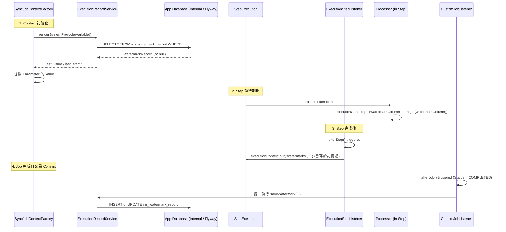
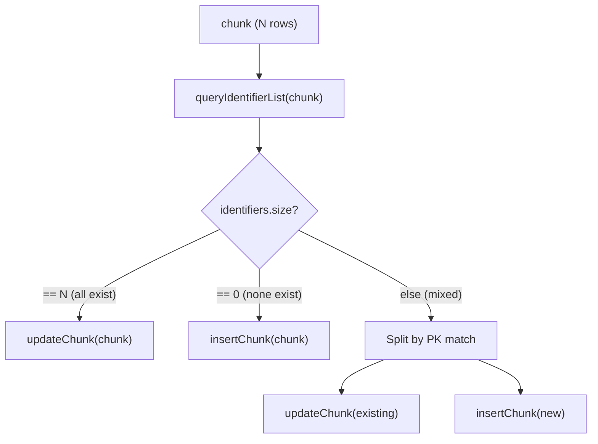
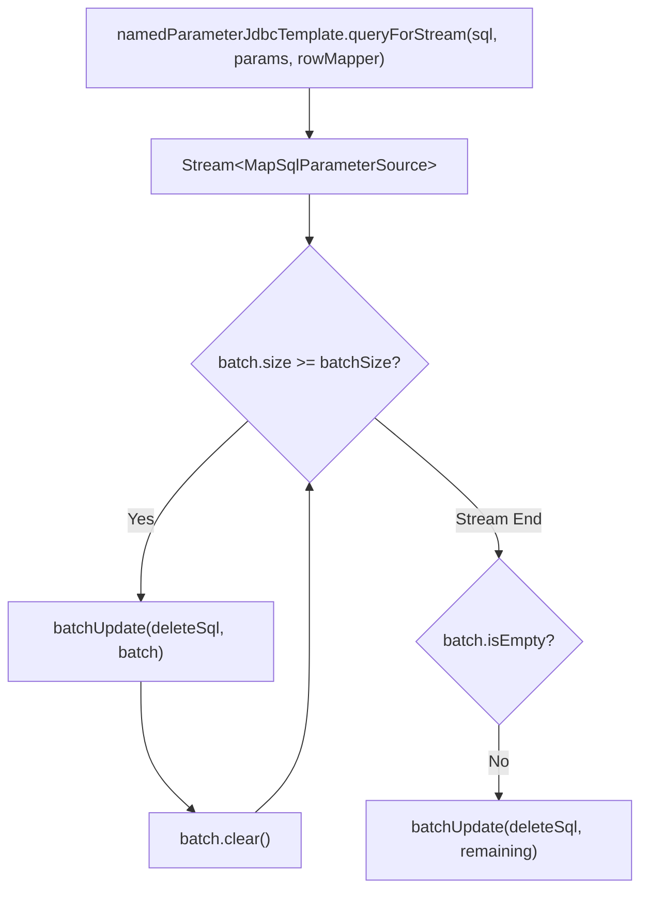
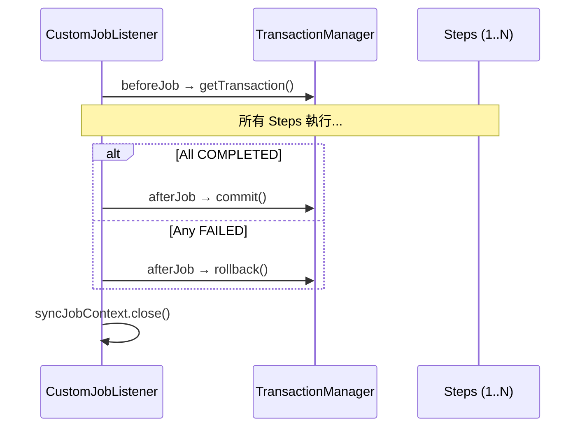
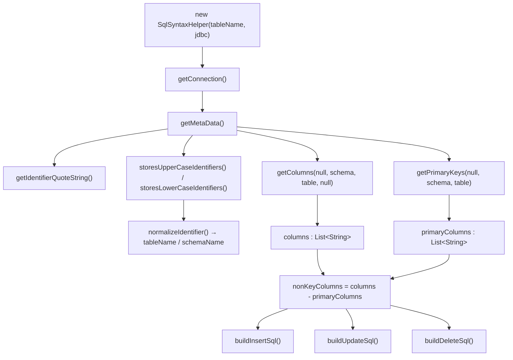

# Design Patterns

## 1. Watermark 機制

### 概念

Watermark 是增量同步的核心，記錄「上次同步到哪裡」，下次同步從該點繼續。

### 涉及元件

| Component | Role |
|---|---|
| `SimpleEnum.SystemProvideVariable` | 定義 4 種系統提供變數 |
| `ExecutionRecordService.fetchValue()` | 查詢歷史 watermark 值 (由 App DB 讀取) |
| `ExecutionRecordService.saveWatermark()` | 寫回新 watermark 值 (由 CustomJobListener 在 Job 結束時統一代勞，寫入 App DB) |
| `SyncJobContextFactory.renderSystemProvoderVariable()` | 在 context 初始化時替換參數 |
| `ExecutionStepListener.afterStep()` | Step 完成後，將新的 watermark 值暫存入 `ExecutionContext` |
| `CustomJobListener.afterJob()` | Job COMPLETED 且交易成功後，統一將收集的 watermark 寫入 App DB (At-Least-Once 防護) |
| `SyncJobProp.Execution.executionContext` | 暫存執行期間的 watermark 值 |

### 4 種系統變數

| Variable | 對應 Record 欄位 | 用途 |
|---|---|---|
| `_LAST_WATERMARK` | `last_value` | 上次同步的最後一筆資料值（例如 auto_increment ID 或 timestamp） |
| `_LAST_START` | `last_start_time` | 上次同步 Step 的開始時間 |
| `_LAST_END` | `last_end_time` | 上次同步 Step 的結束時間 |
| `_LAST_UPDATE` | `last_update_time` | 上次 watermark 紀錄的更新時間 |

### 資料流



### Record 表結構

| Column | Type | Description |
|---|---|---|
| `execution_name` | VARCHAR | 執行名稱（PK 之一） |
| `table_name` | VARCHAR | 目標表名（PK 之一） |
| `watermark_column` | VARCHAR | watermark 欄位名（PK 之一） |
| `last_value` | VARCHAR | 最後一筆值 |
| `last_start_time` | TIMESTAMP | 最後開始時間 |
| `last_end_time` | TIMESTAMP | 最後結束時間 |
| `last_update_time` | TIMESTAMP | 紀錄更新時間 |

---

## 2. Upsert 策略（BatchUpsertWriter）

### 核心思路

由於不依賴任何資料庫特有語法（如 `MERGE`、`ON DUPLICATE KEY UPDATE`），UPSERT 透過「先查再分流」實現：



### 主鍵識別機制

```java
// 產生複合主鍵的識別字串
private String generateCompositePkIdentifier(Map<String, Object> item, List<String> primaryKeys) {
    StringBuilder sb = new StringBuilder();
    for (String primaryKey : primaryKeys) {
        sb.append(item.getOrDefault(primaryKey, "NULL")).append("|");
    }
    return sb.toString();  // 例如: "1|" 或 "pk1_val|pk2_val|"
}
```

### EXISTS 查詢 SQL

`SqlSyntaxHelper.buildExistsQuery(chunkSize)` 產生的 SQL:

**單一主鍵** (chunkSize=3, pk=`id`):
```sql
SELECT "id" FROM "TABLE"
  WHERE ("id" = ?)
     OR ("id" = ?)
     OR ("id" = ?)
```

**複合主鍵** (chunkSize=2, pk=`region_id, product_id`):
```sql
SELECT "region_id", "product_id" FROM "TABLE"
  WHERE ("region_id" = ? AND "product_id" = ?)
     OR ("region_id" = ? AND "product_id" = ?)
```

---

## 3. Delete Threshold 保護（DeleteTasklet）

### 作用

防止意外刪除大量資料。在執行 DELETE 前先 COUNT，超過閾值即中止。

### 判斷邏輯

```java
if (countToDelete != null 
    && countToDelete > deleteThreshold 
    && deleteThreshold != -1) {
    throw new CustomJobExecutionException(jobName, errorMessage);
}
```

| Condition | Behavior |
|---|---|
| `countToDelete <= threshold` | 正常執行刪除 |
| `countToDelete > threshold` && `threshold != -1` | 拋出例外，中止 |
| `threshold == -1` | **不限制**，直接執行 |

### Delete 執行方式

採用 **streaming + batch** 模式：



---

## 4. 原子性交易（CustomJobListener）

### 設計

整個 Job 的所有 Step 可以包在一個交易內，全部成功才 commit，任何一個 Step 失敗就全部 rollback。



### 控制參數

- `openJobTransaction`: 是否啟用 Job 級別交易（目前在 `SyncJobFactory.createBatchJob()` 中**固定為 true**）

---

## 5. SQL 自動建構（SqlSyntaxHelper）

### 職責

透過 JDBC `DatabaseMetaData` API 在建構時取得目標表的 schema 資訊，自動組裝 SQL。

### 建構流程



### 產出的 Public Fields

| Field | Type | Example |
|---|---|---|
| `columns` | `List<String>` (不可變) | `["ID", "NAME", "STATUS"]` |
| `primaryColumns` | `List<String>` (不可變) | `["ID"]` |
| `nonKeyColumns` | `List<String>` (不可變) | `["NAME", "STATUS"]` |
| `insertSql` | `String` | `INSERT INTO "TABLE" VALUES (:ID, :NAME, :STATUS)` |
| `updateSql` | `String` | `UPDATE "TABLE" SET "NAME" = :NAME, "STATUS" = :STATUS WHERE "ID" = :ID` |
| `deleteSql` | `String` | `DELETE FROM "TABLE" WHERE "ID" = :ID` |

### 跨資料庫相容性

| Database | `identifierQuoteString` | Case Strategy |
|---|---|---|
| H2 / Oracle | `"` | `storesUpperCaseIdentifiers = true` → 全大寫 |
| PostgreSQL | `"` | `storesLowerCaseIdentifiers = true` → 全小寫 |
| MySQL / MariaDB | `` ` `` | 兩者皆 false → 維持原始 |
