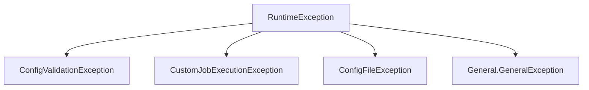

# Error Handling

## Exception Hierarchy



## Exception Details

### ConfigValidationException

**用途**: Job 設定檔驗證失敗

| Field | Type | Description |
|---|---|---|
| `jobName` | String | Job 名稱 |
| `executionName` | String | Execution 名稱 |
| `message` | String | 錯誤訊息 |

**`getMessage()` 邏輯**:
- `jobName` 有值 + `executionName` 為 blank → 回傳 `message`（只有 message）
- 否則 → `"job: %s, execution: %s, error: %s"`

### CustomJobExecutionException

**用途**: Job 執行期間錯誤（如 delete threshold exceeded、job launch 失敗）

| Field | Type | Description |
|---|---|---|
| `jobName` | String | Job 名稱 |
| `message` | String | 錯誤訊息 |

**`getMessage()`**: `"jobName: %s, error: %s"`

### ConfigFileException

**用途**: 設定檔讀取失敗

| Field | Type | Description |
|---|---|---|
| `configPath` | String | 設定檔路徑 |
| `message` | String | 錯誤訊息 |

> ⚠️ 目前 `GlobalExceptionHandler` 中對應的 handler **已被註解**

### General.GeneralException

**用途**: 通用錯誤（區分 server/client error）

| Field | Type | Description |
|---|---|---|
| `isServerError` | boolean | true=500, false=400 |
| `message` | String | 錯誤訊息 |

### General.GeneralExceptionResponse

```java
record GeneralExceptionResponse(String message) {}
```

統一的 API 錯誤回應格式。

---

## GlobalExceptionHandler Mapping

`@RestControllerAdvice`，統一處理所有 REST API 例外。

| Handler Method | Exception | HTTP Status | Response Body |
|---|---|---|---|
| `handle(MethodArgumentNotValidException)` | Bean Validation | 400 | `Map<fieldName, errorMessage>` |
| `handle(ResponseStatusException)` | Spring 內建 | 依原始 status | `GeneralExceptionResponse` |
| `handle(ConfigValidationException)` | 設定驗證 | 400 | `Map{jobName, executionName, message}` |
| `handle(General.GeneralException)` | 通用例外 | 依 `isServerError` | `GeneralExceptionResponse` |
| `handle(CustomJobExecutionException)` | Job 執行錯誤 | 500 | `GeneralExceptionResponse` |
| `handle(RuntimeException)` | Fallback | 500 | `GeneralExceptionResponse` |
| ~~`handle(ConfigFileException)`~~ | ~~設定檔錯誤~~ | ~~500~~ | ~~已註解~~ |

### Handler 優先順序

Spring 會依照例外繼承鏈選擇最具體的 handler：
1. `ConfigValidationException` (最具體)
2. `CustomJobExecutionException`
3. `General.GeneralException`
4. `RuntimeException` (最寬泛 fallback)
