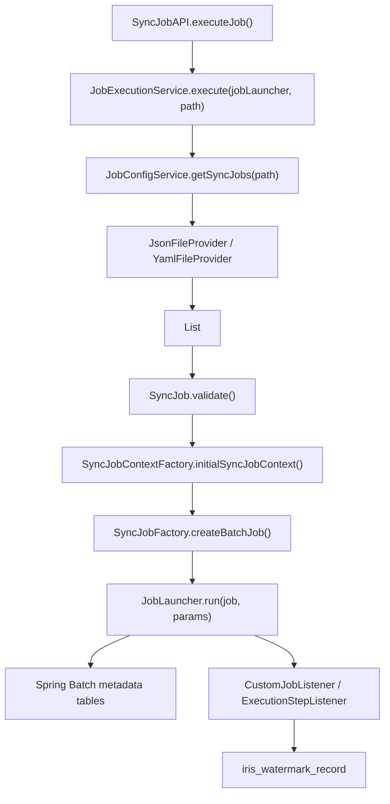

# IrisPipe Full Implementation Guide

This document is a code-first walkthrough of the current IrisPipe backend.
It is intended to help someone fully understand what the project actually does today, not only what the architecture docs hope it will do in the future.

## 1. What IrisPipe is right now

At runtime, IrisPipe is a Spring Boot application that:

1. Reads one config file from the `jobs/` directory.
2. Deserializes the file into `List<SyncJob>`.
3. Validates each job definition.
4. Builds an in-memory `SyncJobContext` with source and destination JDBC data sources.
5. Converts each configured execution into a Spring Batch `Step`.
6. Launches the assembled Spring Batch `Job`.
7. Stores job metadata in Spring Batch tables.
8. Stores watermark state in the application table `iris_watermark_record` only after the whole job completes successfully.

This is not yet a scheduler, a distributed worker system, or a multi-tenant control plane.
Those ideas appear in some feature docs, but the current codebase is a single-process file-driven batch engine with REST endpoints for config management and manual execution.

## 2. Source of truth

When the docs and code disagree, the code wins.

The most trustworthy files for understanding the current implementation are:

- `src/main/java/custom/tibame201020/IrisPipe/api/*`
- `src/main/java/custom/tibame201020/IrisPipe/service/*`
- `src/main/java/custom/tibame201020/IrisPipe/factory/*`
- `src/main/java/custom/tibame201020/IrisPipe/batch/*`
- `src/main/java/custom/tibame201020/IrisPipe/data/*`
- `src/main/resources/application.yaml`
- `src/main/resources/db/migration/*`
- `k6/*.test.js`

The architecture docs under `docs/architecture/` are mostly aligned with current code.
Some feature docs under `docs/feature/` describe planned directions rather than shipped behavior, especially the multi-tenancy, distributed architecture, and secrets-management documents.

## 3. Runtime stack

From `pom.xml` and the running code:

- Java 21
- Spring Boot 3.5.11
- Spring Batch
- Spring Web
- Spring Data JPA
- Spring JDBC / `NamedParameterJdbcTemplate`
- Flyway
- H2 for local default app database
- Lombok
- Springdoc OpenAPI UI
- K6 for end-to-end regression scripts

`application.yaml` shows the default runtime shape:

- App name: `IrisPipe`
- Virtual threads enabled
- H2 console enabled at `/h2-console`
- App DB: `jdbc:h2:./h2data/data;AUTO_SERVER=true;DB_CLOSE_DELAY=-1`
- Spring Batch auto-run disabled
- Flyway enabled
- Config root directory: `jobs`

That means the app database is not only for Spring Batch metadata.
It also owns the watermark table used by the sync engine.

## 4. Top-level module map

The packages divide responsibilities cleanly:

- `api`: REST controllers
- `dto`: request/response records
- `provider`: JSON/YAML file loading
- `data`: config model, enums, runtime summary objects, watermark entity
- `service`: config CRUD, job execution orchestration, watermark persistence, metadata cleanup
- `factory`: runtime context creation and batch job assembly
- `context`: JDBC-related runtime containers
- `batch.builder`: reusable Spring Batch bean builders
- `batch.listener`: job and step listeners
- `batch.tasklet`: `DELETE` and `EXECUTE` step implementations
- `batch.writer`: custom writers for insert/update/upsert behavior
- `batch.entity` and `batch.repo`: JPA mappings for Spring Batch metadata tables
- `repo`: application-level repository for watermark persistence
- `utility`: SQL generation and collection helpers

This separation is important because IrisPipe is not using Spring Batch declarative jobs from static configuration.
Jobs are assembled dynamically from uploaded YAML/JSON files.

## 5. API surface

There are three controllers.

### 5.1 `SyncConfigAPI`

Base path: `/api/v1/sync-config`

Endpoints:

- `GET /api/v1/sync-config`
- `GET /api/v1/sync-config?path=...`
- `POST /api/v1/sync-config` with multipart form
- `PUT /api/v1/sync-config` with multipart form
- `PATCH /api/v1/sync-config` with multipart form
- `DELETE /api/v1/sync-config?path=...`

This controller is just a thin wrapper over `JobConfigService`.
All file operations are rooted at `config.accept-path`, which defaults to `jobs`.

### 5.2 `SyncJobAPI`

Base path: `/api/v1/sync-job`

Endpoints:

- `POST /api/v1/sync-job`
- `GET /api/v1/sync-job?ids=...`
- `GET /api/v1/sync-job/{jobId}`
- `DELETE /api/v1/sync-job/{jobId}`

This controller does four things:

- trigger execution
- fetch summary metadata
- fetch detail metadata
- delete stored metadata

It does not provide restart, scheduling, cron registration, dependency graphs, or retry policy management.

### 5.3 `TestSupportAPI`

Base path: `/api/v1/test-support`

Endpoints:

- `POST /api/v1/test-support/execute`
- `POST /api/v1/test-support/query`

This controller exists only to support K6 tests.
It directly executes SQL on the application datasource.
That is useful for local regression testing, but it is not production-safe functionality.

## 6. Config lifecycle in detail

The config CRUD flow lives in `JobConfigService`.

### 6.1 Supported file types

`JobConfigService` selects a file provider by extension:

- `.json` -> `JsonFileProvider`
- `.yaml` or `.yml` -> `YamlFileProvider`

Each provider:

- reads file content using `Files.readString`
- deserializes with Jackson `ObjectMapper`
- returns `List<SyncJob>`

### 6.2 Validation before persistence

When a user uploads a file through create/update/patch:

1. `JobConfigService.syncConfigControl(...)` checks the requested relative path.
2. It writes the upload into a temporary file with the same extension.
3. It deserializes the temp file into `List<SyncJob>`.
4. It calls `SyncJob.validate()` on each job.
5. Only if validation passes does it write the real file to the `jobs/` directory.

This is important because IrisPipe validates the actual parsed structure, not only the filename or MIME type.

### 6.3 Path safety

`secureConifgPath()` only rejects `..`.

That means the current guard is lightweight.
It is enough to stop simple directory traversal, but it is not a full canonical-path safety layer.

## 7. The config model

The config file deserializes to `List<SyncJob>`.

`SyncJob` has four top-level fields:

- `jobName`
- `executions`
- `setting`
- `database`

### 7.1 `setting`

`SyncJobProp.Setting` contains:

- `fetchSize`
- `batchSize`
- `deleteThreshold`
- `atomicLevel`

Current meaning:

- `fetchSize` is required for chunk-based read flows
- `batchSize` is required for chunk writers and delete batching
- `deleteThreshold` is only used by `DELETE`
- `atomicLevel` is required by validation

Critical implementation reality:

- `atomicLevel` is validated
- `atomicLevel` is not yet honored by runtime branching

Today, every job still runs through the same job-level transaction listener.

### 7.2 `database`

`SyncJobProp.Database` contains:

- `source`
- `dest`

Each connection includes:

- `driver`
- `url`
- `username`
- `password`

Validation is execution-type aware.
For example:

- `INSERT`, `UPDATE`, `UPSERT` need both source and dest
- `DELETE` and `EXECUTE` only need dest

### 7.3 `execution`

Each execution contains:

- `type`
- `name`
- `sql`
- `destTable`
- `parameters`
- `watermarkColumn`
- `summaryInfo`
- `executionContext`

Only the first six come from the config file.
`summaryInfo` and `executionContext` are runtime-enriched fields rebuilt by `SyncJobContextFactory`.

### 7.4 parameter rendering

Parameters are modeled as:

- `param`
- `value`
- `type`

Supported types are:

- `general`
- `timestamp`

`timestamp` uses `Timestamp.valueOf(...)`.

System-provided parameter names are:

- `_LAST_WATERMARK`
- `_LAST_START`
- `_LAST_END`
- `_LAST_UPDATE`

These are not magical SQL variables inside Spring Batch itself.
They are regular config parameters whose values are replaced before job execution by reading the watermark table.

## 8. Execution validation rules

Validation happens in `SyncJob.validate()` and `SyncJobProp.Execution.validate(...)`.

Important rules:

- `jobName` cannot be blank
- `sql` cannot be blank
- every named SQL parameter in the statement must appear in the config
- `destTable` is required for `INSERT`, `UPDATE`, `UPSERT`, and `DELETE`
- connection info must exist for the databases required by the execution type
- `atomicLevel` must exist

One subtle point:

validation checks whether parameter names exist, not whether parameter values are semantically correct for the target database.

## 9. End-to-end execution path

This is the real execution chain for `POST /api/v1/sync-job`.

## 10. `JobExecutionService`: orchestration boundary

`JobExecutionService` is the real orchestration entry point.

For each `SyncJob` in the file, it:

1. validates again
2. creates a `SyncJobContext`
3. builds a Spring Batch `Job`
4. creates `JobParameters` with a fresh `run.id`
5. launches the job

The config file can contain more than one `SyncJob`, so one API call can launch multiple Spring Batch jobs.

## 11. `SyncJobContextFactory`: runtime assembly before batch starts

This class is central to understanding how static config becomes executable state.

### 11.1 it creates JDBC contexts

For source and destination it builds Hikari data sources, then wraps them in `DatabaseContext`.

Each `DatabaseContext` exposes:

- `DataSource`
- `JdbcTemplate`
- `NamedParameterJdbcTemplate`
- `DataSourceTransactionManager`

### 11.2 it normalizes execution names

If an execution does not define `name`, the factory generates one:

- `{jobName}_{executionType}`

That matters because watermark lookup uses execution name as part of the primary key.

### 11.3 it resolves system variables from watermark state

Before a step runs, the factory calls `ExecutionRecordService.fetchValue(...)` for any parameter whose name matches one of the system-provided variables.

The lookup key is:

- `executionName`
- `destTable`
- `watermarkColumn`

The returned value replaces the configured default parameter value.

### 11.4 it creates per-execution and per-job summaries

Each execution gets a `SummaryInfo` object.
The whole job also gets a job-level `SummaryInfo`.

These are in-memory counters used mainly for listener logging.

## 12. `SyncJobFactory`: dynamic Spring Batch job builder

This class is where the file-based config turns into actual Spring Batch `Step` objects.

For each execution it switches on `ExecutionType`:

- `INSERT`
- `UPDATE`
- `UPSERT`
- `DELETE`
- `EXECUTE`

Then it chains the steps in order using `SimpleJobBuilder`.

### 12.1 job listener

Every job gets a `CustomJobListener` built as:

- destination transaction manager
- `openJobTransaction = true`
- current `SyncJobContext`
- `ExecutionRecordService`

This single constructor call explains one of the biggest current limitations:

the runtime does not branch on `atomicLevel`.
Every job still opens the outer job transaction listener path.

## 13. Chunk-oriented step implementations

`INSERT`, `UPDATE`, and `UPSERT` all use the same general pattern:

- `JdbcCursorItemReader`
- processor
- custom writer

### 13.1 reader construction

`BatchBeanBuilder.creatJdbcCursorItemReader(...)` does the following:

1. Parses named SQL parameters.
2. Converts config parameters into rendered Java objects.
3. Flattens list-valued parameters for JDBC binding.
4. Substitutes named parameters into positional SQL.
5. Builds a `JdbcCursorItemReader<Map<String, Object>>`.

Rows are mapped as `Map<String, Object>` using `ColumnMapRowMapper`.

### 13.2 processor behavior

The processor for `INSERT`, `UPDATE`, and `UPSERT` is almost identical.
It:

1. copies the row into a mutable `HashMap`
2. captures the current watermark candidate into `execution.executionContext()`
3. reads destination table metadata via `SqlSyntaxHelper`
4. fills only missing destination columns with `null`

That fourth point matters.
The changelog notes this was fixed so that existing source values are no longer overwritten with `null`.

### 13.3 `INSERT`

`INSERT` uses:

- `SqlSyntaxHelper.insertSql`
- `BatchInsertWriter`

`BatchInsertWriter` delegates to `JdbcBatchItemWriter` and updates the inserted counter.

### 13.4 `UPDATE`

`UPDATE` uses:

- `SqlSyntaxHelper.updateSql`
- `BatchUpdateWriter`

`BatchUpdateWriter` extends `JdbcBatchItemWriter` and counts affected rows in `processUpdateCounts(...)`.

### 13.5 `UPSERT`

`UPSERT` is implemented in a database-agnostic way.
It does not use vendor-specific SQL like `MERGE` or `ON DUPLICATE KEY UPDATE`.

Instead, for each chunk:

1. `SqlSyntaxHelper.buildExistsQuery(chunkSize)` builds a primary-key lookup SQL statement (containing named parameters).
2. **Hotfix applied**: `BatchUpsertWriter` now converts these named parameters to standard `?` positional placeholders before execution via `JdbcTemplate`.
3. The writer queries which rows already exist in the destination table.
4. The chunk is split into update and insert subsets.
5. Existing rows are updated.
6. New rows are inserted.

This is more portable, but it also means:

- extra round-trip per chunk
- correctness depends on detected primary keys
- behavior is sensitive to metadata ordering and database metadata conventions

## 14. Tasklet step implementations

`DELETE` and `EXECUTE` are not chunk readers.
They are tasklets.

### 14.1 `DELETE`

`DeleteTasklet`:

1. generates destination delete SQL from `SqlSyntaxHelper`
2. renders config parameters
3. runs `SELECT COUNT(*) FROM (...)` over the source selection SQL
4. compares that count against `deleteThreshold`
5. streams rows from the selection query
6. converts each row into `MapSqlParameterSource`
7. batch-deletes rows from destination using primary keys

The threshold rule is:

- `-1` means no guard
- otherwise, delete aborts if count exceeds the threshold

### 14.2 `EXECUTE`

`ExecuteTasklet` simply executes the configured SQL against the destination database inside a Spring transaction.

It is the most direct execution type and is used in the K6 multi-step scenario for:

- truncate
- update
- delete

## 15. Watermark lifecycle

Watermark behavior is the most important project-specific mechanism besides the batch steps themselves.

### 15.1 storage model

The watermark table is `iris_watermark_record`.
Its primary key is:

- `execution_name`
- `table_name`
- `watermark_column`

Stored columns:

- `last_value`
- `last_start_time`
- `last_end_time`
- `last_update_time`

### 15.2 read path

Before a job runs, `SyncJobContextFactory` checks whether a parameter name is one of the system-provided variables.
If yes, it reads the corresponding value using `ExecutionRecordService.fetchValue(...)`.

This is how incremental sync is implemented.

### 15.3 candidate collection path

During row processing in chunk steps:

- the processor stores the latest seen watermark column value into `execution.executionContext()`

After the step completes:

- `ExecutionStepListener.afterStep(...)` copies that value into the Spring Batch `StepExecution` context as a serializable `StepExecutionRecord`

### 15.4 persistence path

After the whole job completes:

- `CustomJobListener.afterJob(...)` commits or rolls back the outer transaction
- only when job status is `COMPLETED` does it call `persistStepExecutionRecords(...)`
- that method writes watermark rows through `ExecutionRecordService.saveWatermark(...)`

So the effective watermark contract today is:

- successful job -> watermark persists
- failed job -> watermark does not persist
- watermark is tied to final job outcome, not mid-step progress

## 16. Transaction model

This is the single most important behavioral truth in the project right now.

### 16.1 what the code does today

`CustomJobListener.beforeJob(...)` opens a destination-side transaction when `openJobTransaction` is `true`.

`CustomJobListener.afterJob(...)` then:

- commits it if status is `COMPLETED`
- rolls it back otherwise

Because `SyncJobFactory` always constructs the listener with `openJobTransaction = true`, every job currently behaves as one job-scoped unit.

### 16.2 what the config suggests but the runtime does not yet do

`atomicLevel` already accepts:

- `JOB`
- `CHUNK`

But there is no runtime split yet.
That means `atomicLevel: CHUNK` is currently a validated setting, not an implemented execution mode.

### 16.3 why the K6 chunk-fail case matters

The file `k6/testfiles/job-chunk-fail.yml` and the script `k6/sync-job-chunk-fail.test.js` describe the desired future partial-commit behavior for chunk mode.

However, the current runtime code does not implement that semantic switch yet.
So the K6 chunk failure scenario should be read as a next-stage regression target, not proof of current production behavior.

## 17. Metadata model and deletion

Spring Batch metadata tables are created explicitly by Flyway migration `V1__init_batch_metadata.sql`.

The code also defines JPA entities for:

- `BATCH_JOB_INSTANCE`
- `BATCH_JOB_EXECUTION`
- `BATCH_JOB_EXECUTION_CONTEXT`
- `BATCH_JOB_EXECUTION_PARAMS`
- `BATCH_STEP_EXECUTION`
- `BATCH_STEP_EXECUTION_CONTEXT`

`JobMetadataService.deleteByJobExecution(...)` deletes metadata manually in dependency order:

1. step execution contexts
2. step executions
3. execution params
4. job execution context
5. job execution
6. job instance

This cleanup endpoint is meant for operator/test tooling, not business logic.

## 18. Error handling

`GlobalExceptionHandler` is the REST boundary for exceptions.

Current mapping in practice:

- `ResourceNotFoundException` -> `404`
- validation errors from request binding -> `400`
- `ConfigValidationException` -> `400`
- `ConfigFileException` -> `400`
- `CustomJobExecutionException` -> `500`
- uncaught `RuntimeException` -> `500`

Config upload errors often become `ConfigFileException` because parsing/validation/writing are all wrapped there.

## 19. What the tests really prove

The project currently has two kinds of verification.

### 19.1 JUnit

`SqlSyntaxHelperTest` is the only real unit test suite with depth.
It verifies:

- column detection
- primary-key detection
- generated insert/update/delete SQL
- generated exists-query SQL
- schema handling
- SQL syntax validity on H2

This gives confidence in SQL-generation behavior, but not in end-to-end execution for all execution types.

### 19.2 K6

The K6 suite is more important for real project behavior.
It covers:

- config CRUD
- config validation failure
- successful insert job
- failed insert job with rollback expectation
- no-watermark flow
- **Composite Primary Key UPSERT** correctness (verified with hotfix)
- **System Variable (Watermark)** increment sync logic
- multi-step flow using execute + insert + execute + execute
- chunk-failure scenario as a future/target behavior regression

What it does not thoroughly cover today:

- `UPDATE` writer correctness
- `UPSERT` writer correctness
- `DELETE` tasklet correctness
- restart semantics
- concurrent executions
- async launcher polling behavior

## 20. Important implementation realities and gotchas

These points are especially important if someone wants to work on the project beyond a high-level tour.

### 20.1 `atomicLevel` is not implemented

This is the biggest architectural gap between config and runtime.

### 20.2 some feature docs are roadmap, not code

The following topics are not implemented in the current backend:

- multi-tenancy
- distributed manager/worker execution
- secret manager integration
- built-in scheduler
- restart API

### 20.3 config-path protection is basic

Only `..` is blocked.
There is no stronger normalization or sandbox guarantee yet.

### 20.4 returned `jobId` is conceptually shaky

`SyncJobDTO.JobSummaryInfo.render(...)` and `JobDetailInfo.render(...)` expose the job instance id as `jobId`, while the controller lookup for detail and delete uses `jobExplorer.getJobExecution(jobId)`, which is execution-oriented.

Because every run currently gets a unique `run.id`, instance and execution creation usually move together and the problem stays hidden.
Still, this is an important concept mismatch to know before adding restart or multiple-execution-per-instance behavior.

### 20.5 `server.bat` is stale

`server.bat` contains a hard-coded path pointing to another local machine path and should not be treated as a reliable startup script for the current workspace.

### 20.6 documentation encoding is inconsistent

Some feature docs contain encoding-garbled text in the current repository checkout.
For implementation work, prefer the code and the architecture docs that render cleanly.

## 21. Recommended reading order for a new contributor

If you want to fully internalize the project, read in this order:

1. `src/main/resources/application.yaml`
2. `pom.xml`
3. `src/main/java/custom/tibame201020/IrisPipe/api/SyncJobAPI.java`
4. `src/main/java/custom/tibame201020/IrisPipe/service/JobExecutionService.java`
5. `src/main/java/custom/tibame201020/IrisPipe/data/SyncJob.java`
6. `src/main/java/custom/tibame201020/IrisPipe/data/SyncJobProp.java`
7. `src/main/java/custom/tibame201020/IrisPipe/factory/SyncJobContextFactory.java`
8. `src/main/java/custom/tibame201020/IrisPipe/factory/SyncJobFactory.java`
9. `src/main/java/custom/tibame201020/IrisPipe/batch/listener/CustomJobListener.java`
10. `src/main/java/custom/tibame201020/IrisPipe/batch/listener/ExecutionStepListener.java`
11. `src/main/java/custom/tibame201020/IrisPipe/batch/tasklet/*`
12. `src/main/java/custom/tibame201020/IrisPipe/batch/writer/*`
13. `src/main/java/custom/tibame201020/IrisPipe/utility/SqlSyntaxHelper.java`
14. `src/main/resources/db/migration/*`
15. `k6/*.test.js`

That order mirrors the true runtime flow.

## 22. If you need to modify the project safely

Use this mental model:

- file config is the contract
- `SyncJobContextFactory` enriches that contract with runtime state
- `SyncJobFactory` translates the enriched model into batch steps
- listeners define the transaction/watermark semantics
- K6 is the most realistic regression safety net currently present

If a change affects:

- transaction boundaries
- watermark timing
- job id semantics
- SQL generation
- config validation

then it should be checked not only against docs, but also against K6 expectations and the next-stage plan.

## 23. Bottom line

The current IrisPipe backend is best understood as:

- a file-driven sync engine
- built on Spring Batch
- with dynamic job construction
- with job-level commit/rollback semantics
- with watermark persistence after successful completion
- with local file-based config CRUD and metadata inspection APIs

It is not yet the larger control-plane platform implied by some roadmap documents.
Understanding that boundary is the key to working on the codebase without overestimating what is already implemented.
