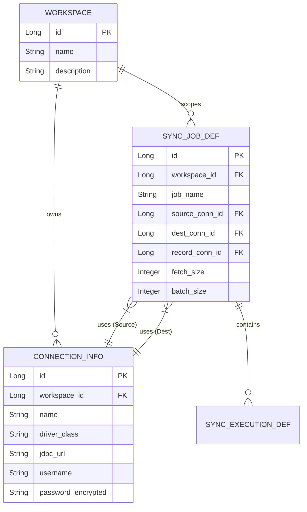

# Feature 01: Multi-tenancy & Database Configuration
# 多租戶與資料庫組態化設計

## 1. 痛點與現狀分析
目前 IrisPipe 依賴本機 `config.accept-path` 資料夾內的 JSON 或 YAML 實體檔案作為排程作業 (Job) 的定義來源。
在單機微服務情境下，這是非常輕量且直觀的做法。然而，若要走向 **企業級資料同步平台**，將面臨以下挑戰：
* **擴展性受限**：若在 Kubernetes (K8s) 環境中部署多個 Pod，實體檔案無法輕易在 Pod 之間共享，導致叢集無法自動橫向擴展 (Horizontal Scaling)。
* **權限隔離困難**：無法區分哪個檔案屬於 A 團隊，哪個檔案屬於 B 團隊。
* **高可用性 (HA) 疑慮**：如果本機硬碟損毀，設定檔將會遺失（除非外掛 PVC 或依靠 GitOps，但仍會犧牲平台即時操作的彈性）。

## 2. 目標與願景
打破實體檔案的限制，將 **「工作區 (Workspace) / 租戶 (Tenant)」** 及 **「定義資料 (Job Definition)」** 完全上雲至關聯式資料庫 (RDBMS)。
達成動態配置、多租戶隔離，並支援多團隊在同一個平台上獨立運作。

## 3. 架構設計與實作規劃

### 3.1 核心概念抽象化
將原本寫在單一 JSON 內的區塊拆解為關聯式的資料表：
1. **`Workspace` (工作區/租戶)**: 代表一個獨立的環境或專案團隊。
2. **`Connection_Info` (連線資源池)**: 集中管理 Database URLs、Drivers。一個 Workspace 可以擁有自己的多個連線位址。
3. **`Sync_Job_Def` (同步任務定義)**: 包含 JobName, Setting, 關聯的 Source/Dest/Record Connection。
4. **`Sync_Execution_Def` (執行步驟定義)**: 對應原本的 `List<Execution>`，包含 SQL、Type (INSERT/UPDATE/UPSERT)、Schema 定義等。

### 3.2 資料庫 Schema 規劃 (ER Model 簡圖)

### 3.3 服務層 (Service Layer) 改造策略
* **重構 `JobConfigService`**：原先實作 `FileProvider` 讀取實體檔案的邏輯，將抽換為 `JpaRepository` 讀取資料庫的實作 (例如 `DatabaseConfigProvider` 引進策略模式)。
* **API 的演進**：`/api/v1/sync-config` 將轉型為標準的 Entity CRUD，並在 Header 中強制要求帶入 `X-Workspace-ID`（或是從 JWT Token 中解析 Tenant Info）來進行資料過濾 (Row-Level Security)。
* **記憶體快取 (Optional)**：考慮到任務啟動時會頻繁讀取組態，可引入 Redis 或 Caffeine 進行 Local Cache，並透過 Pub/Sub 或是 DB Versioning 機制維持快取一致性。

## 4. 預期效益
* **真正的雲原生 (Cloud-Native)**：所有狀態都抽離到共享的 DB 之中，IrisPipe Backend 可以無狀態部署 (Stateless)，支援極限擴充。
* **資源複用**：多個 Sync Job 可以共用同一個 `Connection_Info`，修改密碼時只需改一處，避免舊有 JSON 模式下多個檔案需獨立修改的問題。
* **團隊隔離**：A 領域的開發者登入平台後，只能看到配置給自己的 Workspace，避免誤刪 B 組的 Job。
